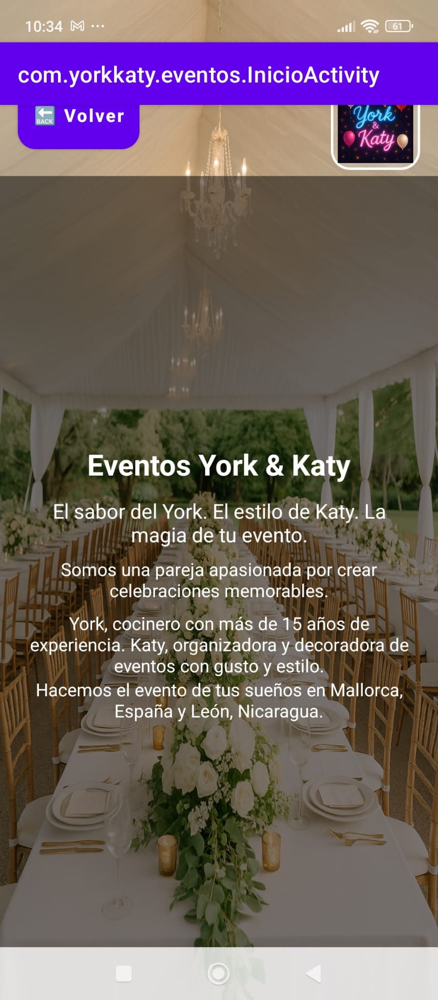
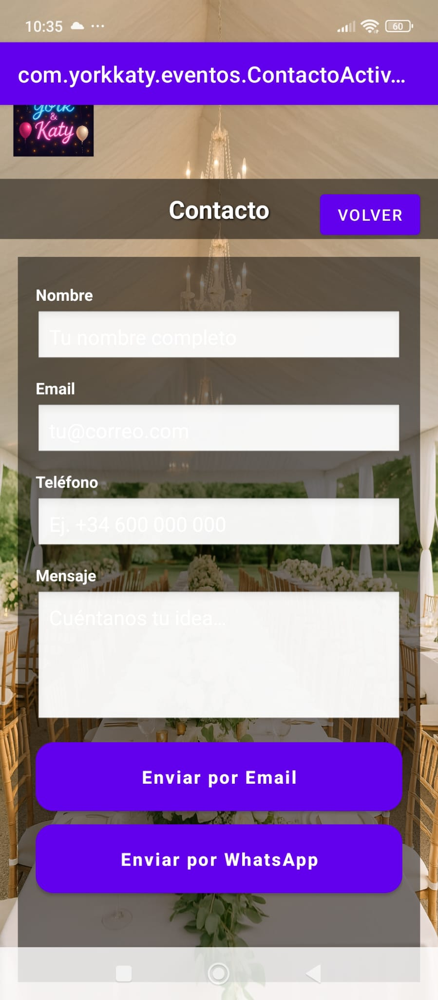

# 📱 Events App – Android Template

A **modern and ready-to-use template** for **events, restaurants, or service businesses**.  
✅ Easy to customize – change logo, colors, and texts in minutes.  
✅ Built with **Material 3 + Android Studio**.  
✅ Compatible with **light and dark mode**.

---

## 🚀 Key Features
- 🏠 **Main menu** with sections: Home, Create Event, View Events, Gallery, Contact, Testimonials, and Food Menu.
- 📅 **Event management**: simple form and dynamic list.
- 🖼 **Interactive gallery** with image upload.
- 📞 **Direct contact** via Email and WhatsApp.
- 💬 **Customizable testimonials**.
- 🍽 **Food menu** ready for restaurants or catering.
- 🌗 **Automatic light/dark mode**.

---

## 📸 Screenshots

### Main Menu


### Home


### Create Event


### Events List


### Gallery


### Contact


### Testimonials


### Food Menu


---

## 🛠️ Customization in 5 Minutes

1️⃣ **Change app name and texts**  
Edit `res/values/strings.xml`:
```xml
<string name="app_name">MyBrand Events</string>
<string name="inicio_slogan">Easily organize your parties 🎉</string>
2️⃣ Change colors and theme
Edit res/values/colors.xml:

xml
Copiar código
<color name="colorPrimary">#00695C</color>
<color name="colorSecondary">#FF9800</color>
3️⃣ Replace logo and images

res/drawable/logo.png → Your brand logo

res/drawable/fondo.png → App background

4️⃣ Change app icon
Use Image Asset Studio.

5️⃣ Build and publish 🚀

Open in Android Studio

Connect an emulator/device

Build > Build Bundle(s) / APK(s) > Build APK(s)

📦 What’s Included
Android source code (Java/Kotlin)

Ready-to-use XML layouts

Colors and styles palette (colors.xml, styles.xml, themes.xml)

Centralized strings (strings.xml)

Example images/logo

Screenshots

🎯 Perfect For
Event organizers 🎤

Restaurants and caterings 🍴

Businesses wanting a quick contact + catalog app

Freelancers looking for a base product for clients

💡 Note
This template is a starting point. You only need to update texts, colors, and images to adapt it to your brand.


