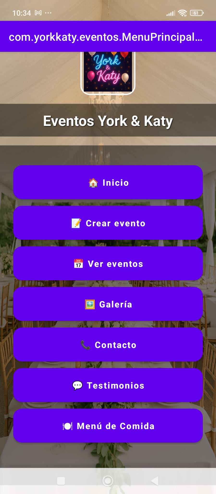
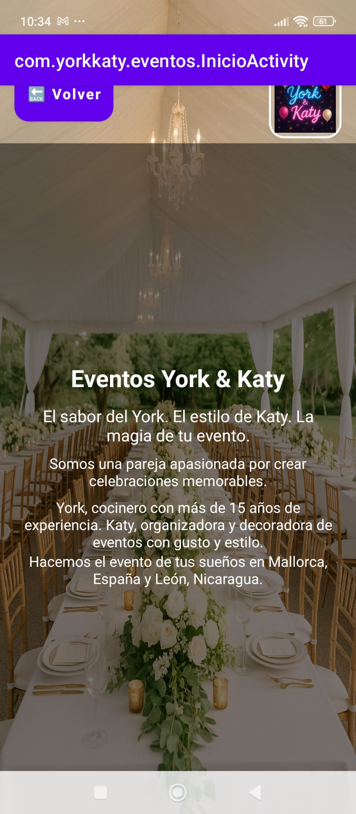
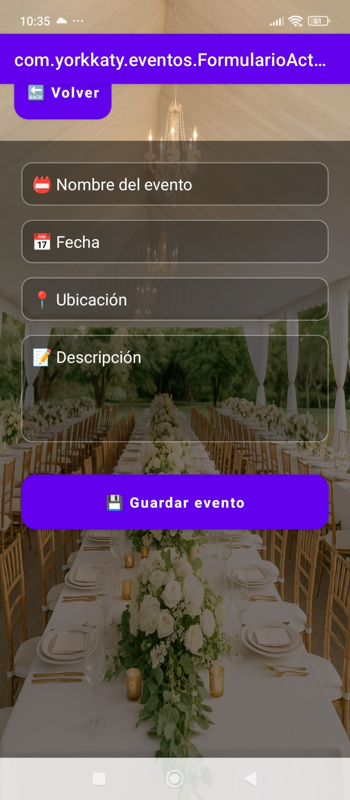
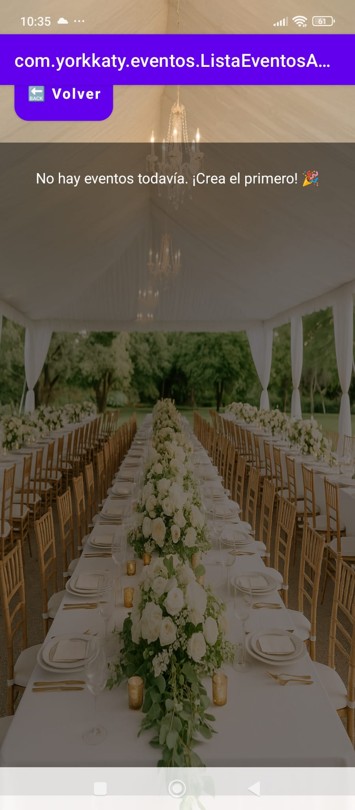
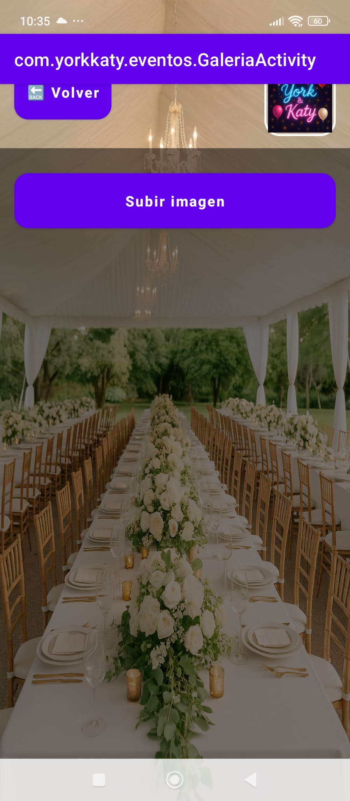
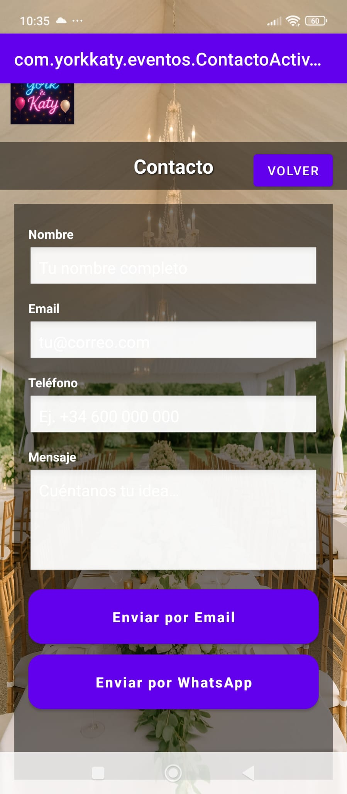
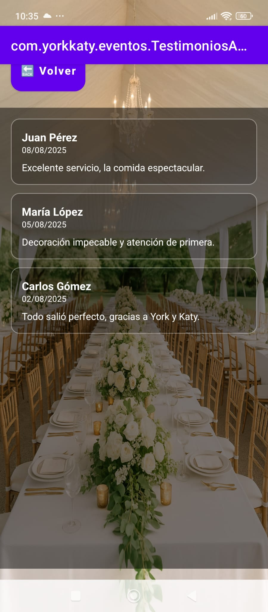
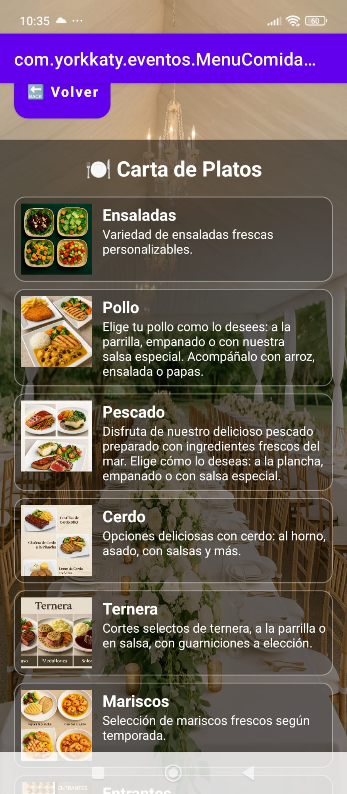

📱 App de Eventos – Plantilla Android

🌍 Read this in [English](README-en.md)

[English](README-en.md) · [Español](README.md)

**Contenido**
- [Características](#-características-principales)
- [Capturas](#-capturas-de-pantalla)
- [Personalización](#-personalización-en-5-minutos)
- [Compila y publica](#-compila-y-publica-)

Una plantilla moderna y lista para usar en proyectos de eventos, restaurantes o negocios de servicios.
✅ Fácil de personalizar – cambia logo, colores y textos en minutos.
✅ Construida con Material 3 + Android Studio.
✅ Compatible con tema claro y oscuro.

🚀 Características principales

🏠 Menú principal con secciones: Inicio, Crear evento, Ver eventos, Galería, Contacto, Testimonios y Carta de platos.

📅 Gestión de eventos: formulario sencillo y lista dinámica.

🖼 Galería interactiva con subida de imágenes.

📞 Contacto directo vía Email y WhatsApp.

💬 Testimonios personalizables.

🍽 Carta de platos lista para restaurantes o catering.

🌗 Modo claro/oscuro automático.

📸 Capturas de Pantalla
Menú Principal

Inicio

Crear Evento

Lista de Eventos

Galería

Contacto

Testimonios

Carta de Platos

### 📸 Capturas de Pantalla

  
  
  

  
  
  

  
  

🛠️ Personalización en 5 minutos

1️⃣ Cambia el nombre y textos
Edita res/values/strings.xml:

<string name="app_name">Eventos MiMarca</string>
<string name="inicio_slogan">Organiza tus fiestas fácilmente 🎉</string>

2️⃣ Cambia colores y estilo
Edita res/values/colors.xml:

<color name="colorPrimary">#00695C</color>
<color name="colorSecondary">#FF9800</color>

3️⃣ Reemplaza logo e imágenes

res/drawable/logo.png → Logo de tu negocio

res/drawable/fondo.png → Fondo de la app

4️⃣ Cambia el icono de la app
Usa Image Asset Studio
.

5️⃣ Compila y publica 🚀

Abre en Android Studio

Conecta un emulador/dispositivo

Build > Build Bundle(s) / APK(s) > Build APK(s)

📦 Qué incluye la plantilla

Código fuente Android (Java/Kotlin)

Layouts XML listos

Paleta de colores y estilos (colors.xml, styles.xml, themes.xml)

Strings centralizados (strings.xml)

Ejemplo de imágenes/logo

Capturas de pantalla

🎯 Ideal para

Organizadores de eventos 🎤

Restaurantes y caterings 🍴

Negocios que quieran una app de contacto + catálogo rápido

Freelancers que buscan un producto base para clientes

💡 Nota

Esta plantilla es un punto de partida. Solo necesitas cambiar textos, colores e imágenes para que se adapte a tu marca.
